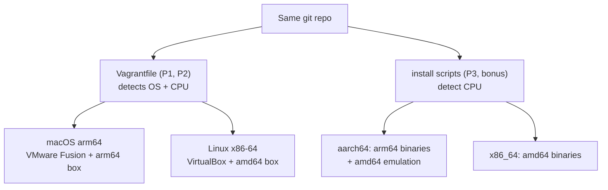
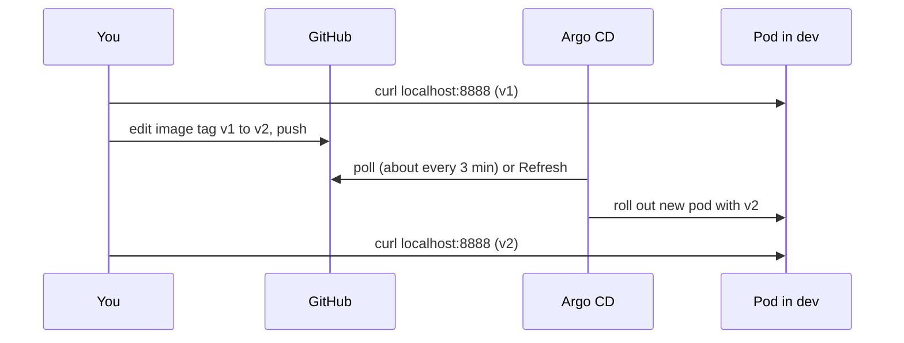
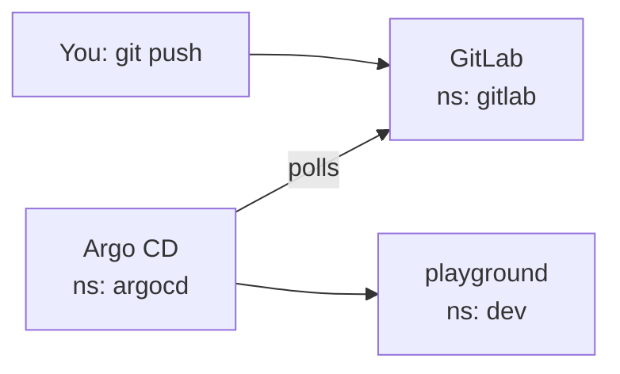

# Inception-of-Things — Step-by-Step Guide

Sep 22, 2026 · @Someone

## Strategy: one repo, two architectures

The same repo runs on your Mac M4 Pro (ARM64) and on the school computers (x86-64). The Vagrantfiles and scripts detect the OS and CPU and pick the matching provider, box and binaries, so you never edit code when you switch machines.



The rule of thumb for the whole project:

- **Never hard-code `amd64` or `arm64`** in a download URL. Use a variable set from `uname -m`.
- **Use multi-arch images** (nginx, busybox, your own image built with `docker buildx`). An amd64-only image on ARM fails with `exec format error`.
- **The Vagrant box must match the CPU.** Vagrant can pick it for you (`box_architecture`), but only if the box publishes both versions.
- **Test on both machines** before the defense. The defense happens on the evaluated group's computer, so decide early which one you'll use.

## Step 0: Decide where each part runs

Use your Mac for development and the school PC for the defense. Nested virtualization (a VM inside a VM) is solid on x86, but on Apple Silicon it needs an M3 or newer, macOS 15 or newer and UTM's Apple Virtualization backend ([source](https://docs.meltcloud.io/tasks/hypervisors/macos)). Even then, nested KVM is still unreliable on M4 ([Lima issue](https://github.com/lima-vm/lima/issues/4498)). So on the Mac you skip that layer for Parts 1 and 2.

|  | Mac M4 Pro (development) | School PC (development + defense) |
| --- | --- | --- |
| P1, P2 (Vagrant) | Vagrant directly on macOS, provider **VMware Fusion** (free for personal use) or VirtualBox 7.1+ | Inside the host VM: Vagrant + **VirtualBox** |
| P3, bonus (Docker, k3d) | Inside a [UTM](https://mac.getutm.app) VM: Debian 13 **arm64** (no nesting needed) | Inside the same host VM |
| Vagrant box | arm64 | amd64 |
| Host VM size | 4 CPUs · 8 GB RAM · 40 GB disk (12 GB RAM or more for the bonus) | same |

The subject says the whole project must run in a VM, so the Mac setup is only for building and testing. The defense runs the real layout at school.

**On the Mac**

1. Install Vagrant: `brew install --cask vagrant` (arm64 build, 2.4+).
2. Install VMware Fusion (download from Broadcom), then `brew install --cask vagrant-vmware-utility` and `vagrant plugin install vagrant-vmware-desktop`. Or install VirtualBox 7.1+ instead.
3. In UTM, create a Debian 13 arm64 VM for Part 3 and the bonus. Pick "Virtualize", not "Emulate".

**At school**

1. Create a Debian 13 amd64 VM in VirtualBox and tick **Settings → System → Processor → Enable Nested VT-x/AMD-V**.
2. Inside it, check that nesting works. The result must be greater than 0:

```bash
grep -cE 'vmx|svm' /proc/cpuinfo
```

3. Clone your repo and run the setup script from Step 1. It installs Vagrant + VirtualBox inside the host VM, or Docker + k3d for Part 3.

## Step 1: Repo layout and platform detection

Create the repo with the exact layout the subject expects, then one small detection snippet that every script reuses.

```
iot/
├── p1/      Vagrantfile  scripts/  confs/
├── p2/      Vagrantfile  scripts/  confs/
├── p3/      scripts/  confs/
└── bonus/   scripts/  confs/
```

**The detection snippet (bash).** Paste it at the top of each script. `uname -s` gives the OS, `uname -m` gives the CPU, and both are normalized to the names download sites use:

```bash
detect_platform() {
  case "$(uname -s)" in
    Linux)  OS=linux ;;
    Darwin) OS=darwin ;;
    *) echo "Unsupported OS: $(uname -s)"; exit 1 ;;
  esac
  case "$(uname -m)" in
    x86_64|amd64)  ARCH=amd64 ;;
    aarch64|arm64) ARCH=arm64 ;;
    *) echo "Unsupported CPU: $(uname -m)"; exit 1 ;;
  esac
  echo "==> Platform: $OS/$ARCH"
}
```

**The same thing in a Vagrantfile (Ruby).** Vagrant runs Ruby, so detection uses `RbConfig`:

```ruby
require "rbconfig"
HOST_OS  = RbConfig::CONFIG["host_os"]    # "linux-gnu", "darwin24"...
HOST_CPU = RbConfig::CONFIG["host_cpu"]   # "x86_64", "arm64", "aarch64"
IS_MAC   = HOST_OS.include?("darwin")
IS_ARM   = HOST_CPU.match?(/arm64|aarch64/)
```

**Host setup script, `p1/scripts/setup_host.sh`.** Run it once on each machine. It installs Vagrant and a provider that fits the platform:

```bash
#!/usr/bin/env bash
set -euo pipefail
# ...paste detect_platform here...
detect_platform

if [ "$OS" = darwin ]; then
  command -v brew >/dev/null || { echo "Install Homebrew first"; exit 1; }
  brew install --cask vagrant vagrant-vmware-utility
  vagrant plugin install vagrant-vmware-desktop
  echo "==> Install VMware Fusion yourself (Broadcom download), then run: vagrant up"
  exit 0
fi

if [ "$ARCH" = arm64 ]; then
  echo "HashiCorp ships Vagrant for Linux amd64 only."
  echo "On an ARM Linux VM, run Parts 1-2 from macOS instead (see Step 0)."
  exit 1
fi

# Linux amd64 (school host VM): Vagrant + VirtualBox
sudo apt-get update
sudo apt-get install -y curl gpg lsb-release build-essential "linux-headers-$(uname -r)"

curl -fsSL https://apt.releases.hashicorp.com/gpg \
  | sudo gpg --dearmor --yes -o /usr/share/keyrings/hashicorp.gpg
echo "deb [signed-by=/usr/share/keyrings/hashicorp.gpg] https://apt.releases.hashicorp.com $(lsb_release -cs) main" \
  | sudo tee /etc/apt/sources.list.d/hashicorp.list

curl -fsSL https://www.virtualbox.org/download/oracle_vbox_2016.asc \
  | sudo gpg --dearmor --yes -o /usr/share/keyrings/virtualbox.gpg
echo "deb [arch=amd64 signed-by=/usr/share/keyrings/virtualbox.gpg] https://download.virtualbox.org/virtualbox/debian $(lsb_release -cs) contrib" \
  | sudo tee /etc/apt/sources.list.d/virtualbox.list

sudo apt-get update
VBOX_PKG=$(apt-cache search --names-only '^virtualbox-[0-9.]+$' | awk '{print $1}' | sort -V | tail -1)
sudo apt-get install -y vagrant "$VBOX_PKG"
sudo usermod -aG vboxusers "$USER"
echo "==> Done. Log out and back in, then: vagrant up"
```

The script picks the newest VirtualBox package in Oracle's repo, so it keeps working when a new version comes out. Vagrant from HashiCorp's repo is 2.4 or newer, which you need for `box_architecture` in Part 1.

## Part 1: K3s and Vagrant

One Vagrantfile creates two VMs, `<login>S` (K3s server) and `<login>SW` (K3s agent), and picks the box architecture and provider from the machine it runs on. Replace `yourlogin` with a real login from your team.

**`p1/Vagrantfile`**

```ruby
# -*- mode: ruby -*-
require "rbconfig"
require "securerandom"
require "fileutils"

LOGIN     = "yourlogin"
SERVER_IP = "192.168.56.110"
WORKER_IP = "192.168.56.111"

# --- Platform detection -------------------------------------------
HOST_OS  = RbConfig::CONFIG["host_os"]
HOST_CPU = RbConfig::CONFIG["host_cpu"]
IS_MAC   = HOST_OS.include?("darwin")
IS_ARM   = HOST_CPU.match?(/arm64|aarch64/)

BOX      = ENV.fetch("IOT_BOX", "bento/debian-13")
BOX_ARCH = IS_ARM ? "arm64" : "amd64"
PROVIDER = ENV.fetch("IOT_PROVIDER", IS_MAC ? "vmware_desktop" : "virtualbox")
ENV["VAGRANT_DEFAULT_PROVIDER"] = PROVIDER

# --- Shared K3s token: generated once, never committed ------------
TOKEN_FILE = File.join(__dir__, ".vagrant", "k3s-token")
FileUtils.mkdir_p(File.dirname(TOKEN_FILE))
File.write(TOKEN_FILE, SecureRandom.hex(32)) unless File.exist?(TOKEN_FILE)
K3S_TOKEN = File.read(TOKEN_FILE).strip

NODES = [
  { name: "#{LOGIN}S",  ip: SERVER_IP, script: "scripts/server.sh" },
  { name: "#{LOGIN}SW", ip: WORKER_IP, script: "scripts/worker.sh" },
]

Vagrant.configure("2") do |config|
  config.vm.box              = BOX
  config.vm.box_architecture = BOX_ARCH
  config.vm.box_check_update = false
  config.vm.synced_folder ".", "/vagrant", disabled: true

  NODES.each do |node|
    config.vm.define node[:name] do |m|
      m.vm.hostname = node[:name]
      m.vm.network "private_network", ip: node[:ip]

      m.vm.provider "virtualbox" do |vb|
        vb.name   = node[:name]
        vb.cpus   = 1
        vb.memory = 1024
      end
      m.vm.provider "vmware_desktop" do |vw|
        vw.gui = false
        vw.vmx["displayName"] = node[:name]
        vw.vmx["numvcpus"]    = "1"
        vw.vmx["memsize"]     = "1024"
      end

      m.vm.provision "shell", path: node[:script], env: {
        "K3S_TOKEN" => K3S_TOKEN,
        "NODE_IP"   => node[:ip],
        "SERVER_IP" => SERVER_IP,
      }
    end
  end
end
```

What makes it "modern": one loop instead of copy-pasted blocks, scripts in files instead of inline heredocs, no shared folder, no secret committed, and settings you can override with environment variables (`IOT_BOX=... vagrant up`). Add `.vagrant/` to `.gitignore`.

**`p1/scripts/server.sh`**

```bash
#!/usr/bin/env bash
set -euo pipefail
# Find the interface that carries 192.168.56.x (eth1 on most boxes)
IFACE=$(ip -o -4 addr show | awk -v ip="$NODE_IP" '$4 ~ "^"ip"/" {print $2}')

curl -sfL https://get.k3s.io | K3S_TOKEN="$K3S_TOKEN" sh -s - server \
  --node-ip "$NODE_IP" \
  --advertise-address "$NODE_IP" \
  --flannel-iface "$IFACE" \
  --write-kubeconfig-mode 644

echo "alias k=kubectl" >> /home/vagrant/.bashrc
```

**`p1/scripts/worker.sh`**

```bash
#!/usr/bin/env bash
set -euo pipefail
IFACE=$(ip -o -4 addr show | awk -v ip="$NODE_IP" '$4 ~ "^"ip"/" {print $2}')

# Wait until the server's API port answers
until (echo > "/dev/tcp/$SERVER_IP/6443") 2>/dev/null; do
  echo "waiting for K3s server..."; sleep 5
done

curl -sfL https://get.k3s.io | \
  K3S_URL="https://$SERVER_IP:6443" K3S_TOKEN="$K3S_TOKEN" sh -s - agent \
  --node-ip "$NODE_IP" \
  --flannel-iface "$IFACE"
```

The K3s installer detects the CPU itself, so these scripts need no arch logic. `kubectl` comes with K3s (`/usr/local/bin/kubectl`).

**Run and verify**

```bash
cd p1
vagrant up                                   # server first, then worker
vagrant ssh yourloginS -c "kubectl get nodes -o wide"
vagrant ssh yourloginSW -c "ip -br a"
```

Success looks like 2 nodes, both `Ready`, INTERNAL-IP `.110` and `.111`, and the worker showing its IP on `eth1`. If the interface has another name (like `enp0s8`), the box uses predictable names: try `IOT_BOX` with another Debian box, or add `net.ifnames=0` to the kernel command line in a provisioning step, since the subject asks for `eth1`.

Useful commands: `vagrant status`, `vagrant halt`, `vagrant destroy -f`, `vagrant provision`.

## Part 2: K3s and three simple applications

One VM (`<login>S`, `192.168.56.110`) runs K3s in server mode, and Traefik (built into K3s) routes requests by `Host` header to app1, app2 (3 replicas) or app3 as the default. All three apps use `nginx:alpine`, which is published for both amd64 and arm64, so no arch logic is needed.

**`p2/Vagrantfile`** reuses the Part 1 header (detection, `BOX`, `PROVIDER`) with a single machine:

```ruby
# ...same header as p1 (require, LOGIN, detection, BOX, PROVIDER)...
SERVER_IP = "192.168.56.110"

Vagrant.configure("2") do |config|
  config.vm.box              = BOX
  config.vm.box_architecture = BOX_ARCH
  config.vm.synced_folder ".", "/vagrant", disabled: true

  config.vm.define "#{LOGIN}S" do |m|
    m.vm.hostname = "#{LOGIN}S"
    m.vm.network "private_network", ip: SERVER_IP
    m.vm.provider "virtualbox" do |vb|
      vb.name = "#{LOGIN}S"; vb.cpus = 1; vb.memory = 2048
    end
    m.vm.provider "vmware_desktop" do |vw|
      vw.gui = false
      vw.vmx["displayName"] = "#{LOGIN}S"
      vw.vmx["numvcpus"] = "1"; vw.vmx["memsize"] = "2048"
    end
    m.vm.provision "file",  source: "confs", destination: "/tmp/confs"
    m.vm.provision "shell", path: "scripts/server.sh", env: { "NODE_IP" => SERVER_IP }
  end
end
```

**`p2/scripts/server.sh`**

```bash
#!/usr/bin/env bash
set -euo pipefail
IFACE=$(ip -o -4 addr show | awk -v ip="$NODE_IP" '$4 ~ "^"ip"/" {print $2}')

curl -sfL https://get.k3s.io | sh -s - server \
  --node-ip "$NODE_IP" --flannel-iface "$IFACE" --write-kubeconfig-mode 644

kubectl wait --for=condition=Ready node --all --timeout=180s
kubectl apply -f /tmp/confs/
echo "alias k=kubectl" >> /home/vagrant/.bashrc
```

**`p2/confs/app-two.yaml`** holds three objects: a ConfigMap (the nginx config), a Deployment (the pods) and a Service (a stable address in front of the pods). The nginx image fills `${HOSTNAME}`, which is the pod name, so each reply shows which replica answered.

```yaml
apiVersion: v1
kind: ConfigMap
metadata:
  name: app-two
data:
  default.conf.template: |
    server {
      listen 80;
      location / {
        default_type text/plain;
        return 200 "Hello from app2 (pod: ${HOSTNAME})\n";
      }
    }
---
apiVersion: apps/v1
kind: Deployment
metadata:
  name: app-two
spec:
  replicas: 3
  selector:
    matchLabels: { app: app-two }
  template:
    metadata:
      labels: { app: app-two }
    spec:
      containers:
        - name: web
          image: nginx:alpine
          ports: [{ containerPort: 80 }]
          volumeMounts:
            - { name: conf, mountPath: /etc/nginx/templates }
      volumes:
        - name: conf
          configMap: { name: app-two }
---
apiVersion: v1
kind: Service
metadata:
  name: app-two
spec:
  selector: { app: app-two }
  ports: [{ port: 80, targetPort: 80 }]
```

Copy it to `app-one.yaml` and `app-three.yaml`: replace every `app-two` with `app-one` / `app-three`, change the message, and set `replicas: 1`.

**`p2/confs/ingress.yaml`** is the routing table Traefik reads. The last rule has no `host`, so it catches everything else:

```yaml
apiVersion: networking.k8s.io/v1
kind: Ingress
metadata:
  name: apps
spec:
  ingressClassName: traefik
  rules:
    - host: app1.com
      http:
        paths:
          - path: /
            pathType: Prefix
            backend: { service: { name: app-one, port: { number: 80 } } }
    - host: app2.com
      http:
        paths:
          - path: /
            pathType: Prefix
            backend: { service: { name: app-two, port: { number: 80 } } }
    - http:
        paths:
          - path: /
            pathType: Prefix
            backend: { service: { name: app-three, port: { number: 80 } } }
```

**Run and verify** from the machine that ran `vagrant up`:

```bash
cd p2 && vagrant up
curl -H "Host: app1.com" 192.168.56.110   # Hello from app1
curl -H "Host: app2.com" 192.168.56.110   # run 3-4 times: the pod name changes
curl 192.168.56.110                        # Hello from app3 (default)
vagrant ssh yourloginS -c "kubectl get all; kubectl get ingress"
```

For a browser, add `192.168.56.110 app1.com app2.com` to `/etc/hosts`. Be ready to show and explain `kubectl describe ingress apps` at the defense, since the subject hides it on purpose.

## Part 3: K3d and Argo CD

No Vagrant here: inside the host VM (UTM on the Mac, VirtualBox at school), one script installs the tools and a second one builds the cluster and Argo CD. Argo CD then deploys whatever your GitHub repo says, and changing `v1` to `v2` there updates the running app.

**The ARM catch:** `wil42/playground` is published for **amd64 only** (both `v1` and `v2`, per its [Docker Hub tags](https://hub.docker.com/r/wil42/playground/tags)). On your Mac VM it fails with `exec format error` unless you do one of these:

| Option | How | Trade-off |
| --- | --- | --- |
| A. Your own multi-arch image (recommended) | Build `v1` and `v2` for amd64 + arm64 with `docker buildx` (below) | 10 minutes of work, native speed on both machines |
| B. Emulate amd64 on ARM | `install.sh` registers QEMU (`tonistiigi/binfmt`) when it detects arm64 | Zero extra work, slower, and lost on reboot (re-run the script) |

**`p3/scripts/install.sh`** installs Docker, kubectl, k3d and the Argo CD CLI for the detected CPU:

```bash
#!/usr/bin/env bash
set -euo pipefail
# ...paste detect_platform here...
detect_platform
[ "$OS" = linux ] || { echo "Run this inside the Linux host VM"; exit 1; }

# Docker (the official script supports amd64 and arm64)
if ! command -v docker >/dev/null; then
  curl -fsSL https://get.docker.com | sudo sh
  sudo usermod -aG docker "$USER"
fi

# kubectl for this CPU
KVER=$(curl -Ls https://dl.k8s.io/release/stable.txt)
curl -Lo /tmp/kubectl "https://dl.k8s.io/release/${KVER}/bin/linux/${ARCH}/kubectl"
sudo install -m 0755 /tmp/kubectl /usr/local/bin/kubectl

# k3d (its installer detects the CPU itself)
curl -s https://raw.githubusercontent.com/k3d-io/k3d/main/install.sh | bash

# Argo CD CLI for this CPU
curl -Lo /tmp/argocd "https://github.com/argoproj/argo-cd/releases/latest/download/argocd-linux-${ARCH}"
sudo install -m 0755 /tmp/argocd /usr/local/bin/argocd

# ARM only: let amd64-only images run through emulation (option B)
if [ "$ARCH" = arm64 ]; then
  sudo docker run --privileged --rm tonistiigi/binfmt --install amd64
fi

echo "==> Done. Log out and back in (docker group), then run setup.sh"
```

**`p3/scripts/setup.sh`** creates the cluster, the two namespaces and Argo CD, then registers your app:

```bash
#!/usr/bin/env bash
set -euo pipefail
DIR="$(cd "$(dirname "$0")/.." && pwd)"

k3d cluster create iot -p "8888:8888@loadbalancer" --wait

kubectl create namespace argocd
kubectl create namespace dev

kubectl apply -n argocd --server-side --force-conflicts \
  -f https://raw.githubusercontent.com/argoproj/argo-cd/stable/manifests/install.yaml
kubectl -n argocd rollout status deploy/argocd-server --timeout=300s

kubectl apply -f "$DIR/confs/application.yaml"

echo "Argo CD admin password:"
argocd admin initial-password -n argocd | head -1
echo "UI: kubectl -n argocd port-forward svc/argocd-server 8080:443  ->  https://localhost:8080"
```

The `--server-side --force-conflicts` flags are required by Argo CD's current install, because some of its CRDs are too large for a normal `kubectl apply` ([Argo CD docs](https://argo-cd.readthedocs.io/en/stable/getting_started/)).

**`p3/confs/application.yaml`** tells Argo CD what to watch and where to deploy it:

```yaml
apiVersion: argoproj.io/v1alpha1
kind: Application
metadata:
  name: playground
  namespace: argocd
spec:
  project: default
  source:
    repoURL: https://github.com/YOUR_GH_USER/yourlogin-iot   # public, login in the name
    targetRevision: HEAD
    path: manifests
  destination:
    server: https://kubernetes.default.svc
    namespace: dev
  syncPolicy:
    automated: { prune: true, selfHeal: true }
```

**The GitHub repo** (separate from your 42 repo) contains `manifests/app.yaml`:

```yaml
apiVersion: apps/v1
kind: Deployment
metadata:
  name: playground
spec:
  replicas: 1
  selector:
    matchLabels: { app: playground }
  template:
    metadata:
      labels: { app: playground }
    spec:
      containers:
        - name: playground
          image: wil42/playground:v1     # or YOUR_DOCKERHUB/yourlogin-playground:v1
          ports: [{ containerPort: 8888 }]
---
apiVersion: v1
kind: Service
metadata:
  name: playground
spec:
  type: LoadBalancer
  selector: { app: playground }
  ports: [{ port: 8888, targetPort: 8888 }]
```

The `LoadBalancer` Service plus the `-p 8888:8888@loadbalancer` mapping on the cluster makes `curl localhost:8888` work from the host VM with no port-forward.

**Option A: build your own multi-arch image.** Put this in an `app/` folder of the GitHub repo:

```nginx
# app/default.conf
server {
  listen 8888;
  location / {
    default_type application/json;
    return 200 '{"status":"ok","message":"__VERSION__"}\n';
  }
}
```

```dockerfile
# app/Dockerfile
FROM nginx:alpine
ARG VERSION=v1
COPY default.conf /etc/nginx/conf.d/default.conf
RUN sed -i "s/__VERSION__/${VERSION}/" /etc/nginx/conf.d/default.conf
```

```bash
docker login
docker run --privileged --rm tonistiigi/binfmt --install all   # lets buildx build the other arch
docker buildx create --use --name multi
cd app
for v in v1 v2; do
  docker buildx build --platform linux/amd64,linux/arm64 \
    --build-arg VERSION=$v -t YOUR_DOCKERHUB/yourlogin-playground:$v --push .
done
```

One tag now holds both architectures, and each machine pulls the one that matches its CPU. That's the cleanest answer to "ARM at home, x86 at school".

**The defense demo**



```bash
kubectl get ns                      # argocd and dev present
kubectl get pods -n dev
curl localhost:8888                 # {"status":"ok", "message": "v1"}

# in your GitHub repo clone:
sed -i 's/:v1/:v2/' manifests/app.yaml
git commit -am "v2" && git push

# don't want to wait for the poll? force a refresh:
kubectl -n argocd annotate application playground argocd.argoproj.io/refresh=hard --overwrite
kubectl get pods -n dev -w          # watch the new pod replace the old one
curl localhost:8888                 # {"status":"ok", "message": "v2"}
```

## Bonus: local GitLab

The bonus is Part 3 with GitHub swapped for a GitLab instance running inside the cluster, in namespace `gitlab`, installed with Helm. **Do it at school (x86-64):** the official chart has had parts without arm64 images (the `shared-secrets` job fails with `exec format error` on ARM, per [chart issue #4868](https://gitlab.com/gitlab-org/charts/gitlab/-/issues/4868)), and amd64 emulation of all of GitLab is far too slow. Give the host VM 12 GB of RAM or more.



1. Recreate the cluster with port 80 exposed so you can reach GitLab through Traefik: `k3d cluster create iot -p "8888:8888@loadbalancer" -p "80:80@loadbalancer" --wait`, then re-run the Argo CD steps from Part 3.
2. Install Helm (its script detects the CPU): `curl -fsSL https://raw.githubusercontent.com/helm/helm/main/scripts/get-helm-3 | bash`.
3. Write `bonus/confs/gitlab-values.yaml`, a minimal install without the parts you don't need:

```yaml
global:
  edition: ce
  hosts:
    domain: iot.local          # GitLab will live at gitlab.iot.local
    https: false
  ingress:
    class: traefik
    configureCertmanager: false
    tls: { enabled: false }
installCertmanager: false
certmanager-issuer: { email: you@example.com }
nginx-ingress: { enabled: false }
prometheus: { install: false }
gitlab-runner: { install: false }
registry: { enabled: false }
gitlab:
  webservice:   { minReplicas: 1, maxReplicas: 1 }
  sidekiq:      { minReplicas: 1, maxReplicas: 1 }
  gitlab-shell: { minReplicas: 1, maxReplicas: 1 }
```

Key names move between chart versions, so check each one against `helm show values gitlab/gitlab` before the defense.

4. Install it (it takes 5–15 minutes to settle):

```bash
kubectl create namespace gitlab
helm repo add gitlab https://charts.gitlab.io/ && helm repo update
helm upgrade --install gitlab gitlab/gitlab -n gitlab \
  -f bonus/confs/gitlab-values.yaml --timeout 900s
kubectl get pods -n gitlab -w
```

5. Open it: add `127.0.0.1 gitlab.iot.local` to `/etc/hosts`, browse to `http://gitlab.iot.local`, and log in as `root` with this password:

```bash
kubectl -n gitlab get secret gitlab-gitlab-initial-root-password \
  -o jsonpath='{.data.password}' | base64 -d; echo
```

6. Create a **public** project named with your login, then push the same `manifests/app.yaml` as in Part 3.
7. Point Argo CD at GitLab's in-cluster address instead of GitHub, in `bonus/confs/application.yaml`:

```yaml
  source:
    repoURL: http://gitlab-webservice-default.gitlab.svc:8181/root/yourlogin-iot.git
    targetRevision: HEAD
    path: manifests
```

8. Run the same v1 → v2 demo, pushing to GitLab this time.

Put every command above in `bonus/scripts/` so the whole bonus rebuilds with one script, like Part 3.

## Defense checklist and troubleshooting

Run the whole project from a fresh clone on a school PC at least once before the defense. That's the only test that proves it works where you'll be graded.

- [ ] Host VM has nested virtualization (`grep -cE 'vmx|svm' /proc/cpuinfo` > 0)
- [ ] P1: `vagrant up` from scratch, 2 nodes `Ready`, IPs `.110` / `.111` on `eth1`, hostnames `<login>S` / `<login>SW`
- [ ] P2: three `curl` tests pass, app2 shows 3 pod names, you can explain `kubectl describe ingress`
- [ ] P3: `install.sh` runs on a clean VM, namespaces `argocd` + `dev` exist, v1 → v2 via a git push works
- [ ] GitHub repo is public and has a login in its name
- [ ] Folder names are exactly `p1`, `p2`, `p3`, `bonus`, each with `scripts/` and `confs/`
- [ ] `.vagrant/` is in `.gitignore`, no token or password committed
- [ ] You can explain K3s vs K3d, server vs agent, Deployment vs Service vs Ingress, and what Argo CD does

| Symptom | Likely cause | Fix |
| --- | --- | --- |
| `vagrant up` can't find the box | No box for this arch + provider | `IOT_BOX=<other box> vagrant up`; search the Vagrant registry filtered by provider and arm64/amd64 |
| VirtualBox says VT-x is unavailable | Nested VT-x off in the host VM | Power off the host VM, tick Enable Nested VT-x/AMD-V |
| Only 1 node, or wrong INTERNAL-IP | K3s picked the NAT interface | Check `--node-ip` and `--flannel-iface` in the scripts |
| Worker stuck, never joins | Different tokens, or server not ready | `vagrant destroy -f` then `vagrant up` (the token file is shared) |
| `404 page not found` on curl | Ingress host or Service name typo | `kubectl describe ingress apps`, check that Service names match |
| Pod in `CrashLoopBackOff` with `exec format error` | amd64-only image on ARM | Use a multi-arch image (Part 3, option A) or re-run `install.sh` (binfmt) |
| `permission denied` on docker.sock | Not in the docker group yet | Log out and back in after `install.sh` |
| Argo CD CRD apply error | Missing server-side flags | `kubectl apply --server-side --force-conflicts ...` |
| Argo CD still on v1 after the push | 3-minute poll interval | Click Refresh in the UI or annotate with `refresh=hard` |

## Sources

- [Nested virtualization on macOS with UTM/tart](https://docs.meltcloud.io/tasks/hypervisors/macos)
- [Lima issue #4498: nested KVM on M4](https://github.com/lima-vm/lima/issues/4498)
- [Vagrant install page](https://developer.hashicorp.com/vagrant/install) (Linux builds are amd64 only)
- [wil42/playground tags on Docker Hub](https://hub.docker.com/r/wil42/playground/tags)
- [Argo CD getting started](https://argo-cd.readthedocs.io/en/stable/getting_started/)
- [k3d](https://k3d.io/stable/)
- [GitLab chart issue #4868: arm64 on K3s](https://gitlab.com/gitlab-org/charts/gitlab/-/issues/4868)
- [GitLab Helm chart deployment](https://docs.gitlab.com/charts/installation/deployment/)
